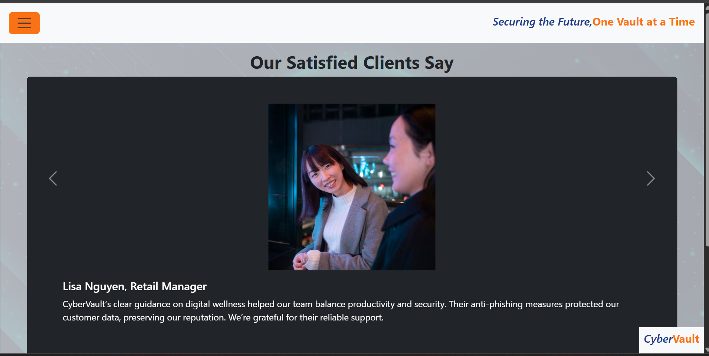

# CyberVault Business Website
=======
This project is a simple cybersecurity business website made for the Frontend Development Module CA2 assignment.
It shows a small company brand called **CyberVault** with client reviews, an explore page, and a query form.

## What this website is about

- Business-style landing pages for a cybersecurity company
- A homepage with client testimonials and a carousel
- An explore page with phishing awareness content and team member profiles
- A query page with a contact form for security requests
- A responsive layout using Bootstrap and custom styling

## Project structure

- `html_files/index.html` - Main page with client review carousel
- `html_files/explore.html` - Information page about phishing and protection
- `html_files/queryus.html` - Query form page for customers
- `main.css` - Custom CSS styles for the website
- `javascript.js` - JavaScript for form behavior and popovers
- `image/` - Image assets used on the site
- `colorpalette` - Color palette reference file

## Languages used

- HTML
- CSS
- JavaScript

## How to open the project

1. Open the project folder in your browser or code editor.
2. Open `html_files/index.html` to start from the homepage.
3. Use the menu to go to `explore.html` or `queryus.html`.

## Notes

- The site uses Bootstrap 5.3 for layout and responsive design.
- Some buttons use Bootstrap popovers to show profile details.
- The query form includes a message counter and urgency slider.

## About the design
=======
This website is a school project. The goal was to make a clean and modern business website for cybersecurity, with a focus on trust, protection, and easy navigation.

